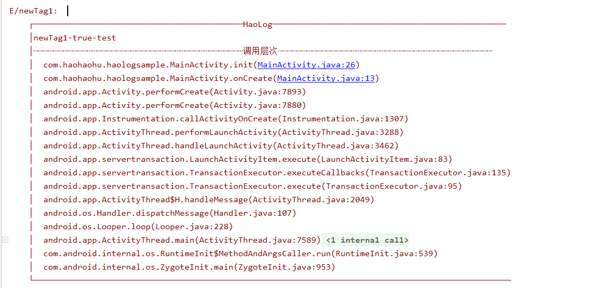

# HaoLog
android log打印工具，便于查询log的调用层次，快速定位bug

# 截图


# 项目添加方法
在根 build.gradle中添加
```
allprojects {
    repositories {
        ...
        maven { url 'https://jitpack.io' }
    }
}
```

在项目build.gradle中添加 
```
dependencies {
    compile 'com.github.ronghao:HaoLog:1.0.0'
}